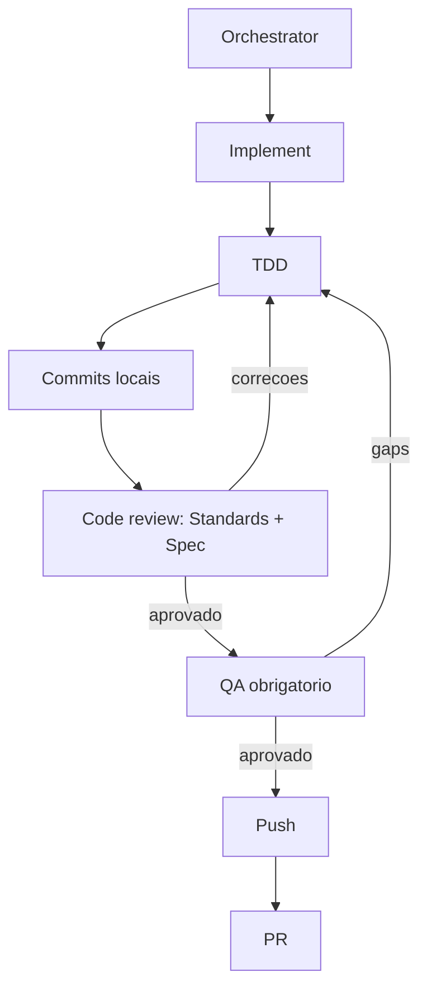

# Governanca de Skills

Leia e siga [`AGENTS.md`](./AGENTS.md), fonte canonica das regras deste repositorio.

Invariantes load-bearing:

1. origem ativa: `diego-anselmo/skills`;
2. `.claude-plugin/plugin.json` e a whitelist publica;
3. skills user-invoked mantem frontmatter Claude e policy Codex pareados;
4. `npm run check` valida catalogo, versao, links e testes;
5. cada GitHub Issue e executada por `/implement`;
6. `/code-review` revisa Standards e Spec antes de `/qa-analyst`;
7. commits locais podem anteceder QA;
8. push e PR somente depois de QA aprovado;
9. nenhuma skill inexistente pode ser invocada como etapa do fluxo.

